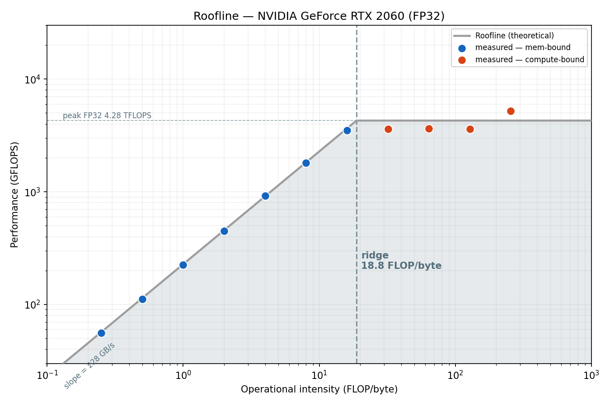
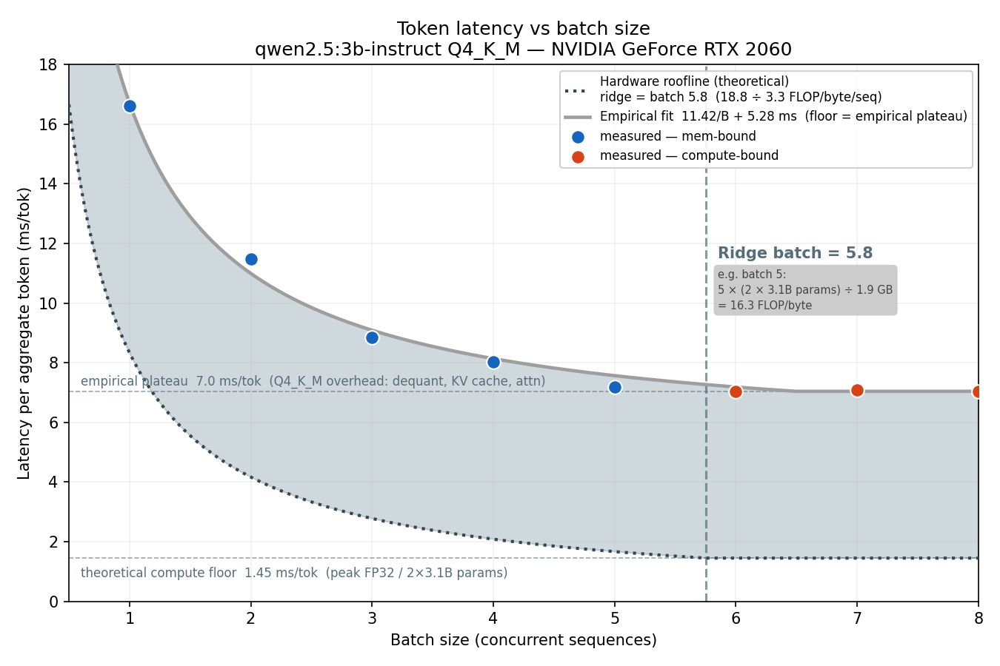

# GPU Roofline and Inference Latency

Roofline: GPU specs + model params predict where inference flips from memory to compute-bound. 

Framework: RTX 2060 ridge ~18.8 FLOP/byte

Qwen2.5-3B Q4 single-sequence decode runs at 3.3 FLOP/byte. Implied ridge batch = 18.8 / 3.3 ≈ 5.8.

Memory-bound regime (batch ≤ 5): adding sequences releases the GPU math hounds. Same weight load, more output. Compute-bound regime (batch ≥ 6): more sequences don't help. Per-token latency goes flat. We can only do so much math.

Benchmarks and LLM inference analysis using the roofline model.

Hardware: NVIDIA GeForce RTX 2060 (sm_75, 30 SMs, 6 GB GDDR6).

 

## Measured hardware

| metric | value |
|--------|-------|
| peak FP32 | ~4.28 TFLOPS (boost) |
| peak BW | ~228 GB/s |
| ridge | ~18.8 FLOP/byte |

## Files

| file | purpose |
|------|---------|
| `roofline.cu` | measure peak FP32 FLOPS and memory bandwidth |
| `sweep.cu` | sweep operational intensity across the roofline |
| `decode_bench.py` | single-sequence ollama decode/prefill rate vs BW ceiling |
| `batch_bench.py` | concurrent batch sweep (batch 1–8) via ollama |

## Build CUDA benchmarks

```bash
nvcc -O3 -arch=sm_75 -o roofline roofline.cu
nvcc -O3 -arch=sm_75 -o sweep sweep.cu
./roofline
./sweep
```

## Run LLM benchmarks

Requires [ollama](https://ollama.com) with `qwen2.5:3b-instruct` loaded.

```bash
# enable parallel batching
sudo systemctl edit ollama   # add: Environment="OLLAMA_NUM_PARALLEL=8"
sudo systemctl restart ollama

uv run python3 decode_bench.py
uv run python3 batch_bench.py
```

## Key result

For qwen2.5:3b Q4\_K\_M (1.9 GB, 3.1B params), intensity per sequence = 3.3 FLOP/byte.
Ridge batch size = 18.8 / 3.3 ≈ **5.8** — measured transition at batch 5→6 confirms this.
